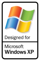
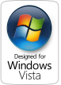
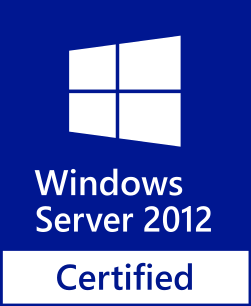
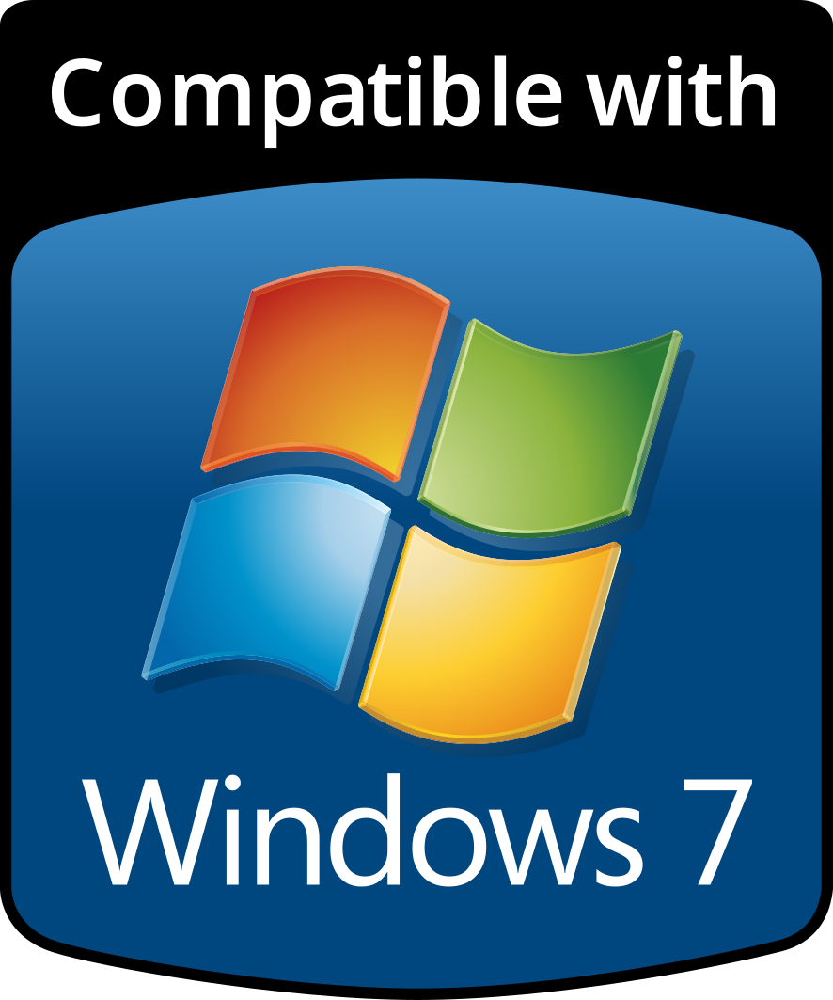
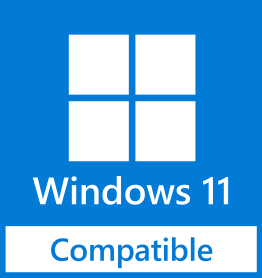
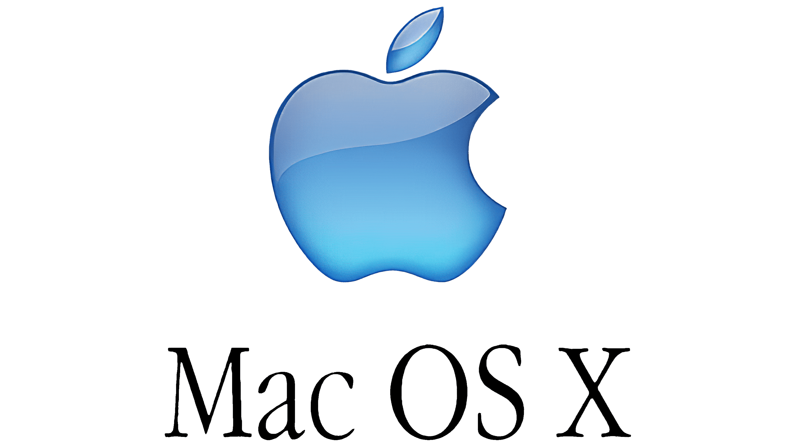

# ShelfSight 
 <b>🇪🇺🇪🇺🇪🇺Made in Europe🇪🇺🇪🇺🇪🇺
 <b><a href=https://github.com/C0m3b4ck/ShelfSight/tree/main/README_PL.md>🇵🇱🇵🇱🇵🇱Przeczytaj po polsku!🇵🇱🇵🇱🇵🇱 </a>
# What is it?
 <h2><b>ShelfSight is a program for managing libraries both large and small, private or public. It is **free, open-source, cross-platform and has legacy-support**.</b></h2>
 <h2><b>A successor to BookwormVB, it is intended to be more robust, more efficient and safer, while having broader OS support and better functionality than Bibliotekarz.NET in the Polish freeware sphere.</b></h2> 
# Help!!! How do I install?!?!?!
1. Open the "Releases" page on the right-hand side of the page.
2. Choose the latest release (the one on top).
3. Download the package that matches your system:

| Type		| Description |
| ** Portable **  | '.7z' archive file, extract using 7zip and run the binary file inside the extracted folder (<b>.exe on Windows</b>). |
| ** Installer ** | A program that moves the program files to a directory specified by the user (<b>for example, %APPDATA% on Windows</b>). |
| **Standalone ** | Just the program binary (<b>.exe on Windows</b>) - download and run. |.
## Supported Operating Systems
| Platform | Versions | Architecture | Packages |
| Microsoft Windows | Versions from XP to 11 (all Windows Server Editions from 2003 to 2025 | x86 and x64 | pre-packaged 'portable', 'installer' and 'standalone' |
| Linux distributions | Kernel versions from [currently unknown] to 7.x.x | x86 and x64 | 'portable', 'installer' and 'standalone' |
| Microsoft Windows (Legacy) | Windows 2000, NT4, Me, 98, 95 | x86 | Packages might not be provided, support for Legacy versions will be finished after 1.0 release |
| Microsoft Windows (CE) | Windows CE 2, 3, 4, 5, 6, .NET 4.1, .NET 4.2 | ARM | Support will be considered after MS Windows Legacy support is finalized |
| Apple MacOS | (THEORETICALLY) supported | MacOS X and above | ARM and ARM64| Users need to compile themselves, there are no official MacOS binaries. | 

The badges are meant to represent compatibility. Badges with the word "certified" ARE A VISUAL REPRESENTATION ONLY. This project is not endorsed nor certified by Microsoft.
Downloaded from https://logos.fandom.com/wiki/Microsoft_Windows/Compatible

<b>FULL LIST of supported MS Windows versions of Windows: </b>

    [Legacy] Windows 95

    [Legacy] Windows NT 4.0

    [Legacy] Windows 98 

    [Legacy] Windows 98 SE

    [Legacy] Windows 2000

    [Legacy] Windows Me

    Windows XP (tested: x86, x32 and 64-bit, Home, Professional, includes: Starter, Tablet PC, Media Center, Embedded)

    Windows Embedded versions, including: Windows Embedded for Point of Service, Windows Embedded Standard 2009, Windows Embedded POSReady 2009

    Windows Server (all versions including 2003, Small Business Server 2003, 2003 R2, Home Server,
    2008, Small Business Server 2008, 2012, 2012 R2, 2016, 2019, 2022, 2025)

    Windows Vista

    Windows 7

    Windows 8

    Windows 8.1

    Windows 10

    Windows 11

    (probable future desktop OS from Microsoft)

 <b>Will require much different compilers, possible re-writes:</b>

    Linux ARM

    [Legacy] Windows CE (including versions 2, 3, 4, 5, 6, .NET 4.1, .NET 4.2, 7, 2013)

    [Legacy] Windows CE for Automotive

    [Legacy] Pocket PC (including versions 2000, 2002)

    Windows Mobile

 <b>Will not be supported: </b> 

* All Xbox OSes
* Windows CE 1.0 (requires DOS-like C compilation)
# Build
Run in POSIX-compatible shell (Linux, MSYS on MS Windows)
'''bash
# Clone the repository
git clone https://github.com/C0m3b4ck/ShelfSight.git
cd ShelfSight/src
# Run build helper
./BUILD_ALL.sh
# Select correct options for your system via numerical input
'''bash
No errors should occur.
# Docs
Docs are available in <i>/DOCS/</i> subfolder. User manuals will be made after 1.0 release.
For now, check out development videos: </b> https://www.youtube.com/watch?v=Hd-j296d3xY&list=PL_FbJyFLAmlil2avw-L_tHQugj_nknzCE 
# Credits
<h3>Started on June 19th, 2026, by C0m3b4ck.<h3> 
<h2>Credits to the authors of the libraries used:</h3>
 <a href=https://fltk.org>FLTK</a>, a simple and light C++ GUI library,
 <a href=https://github.com/weidai11/cryptopp>CryptoPP</a>, a C++ library for hashing and encryption

